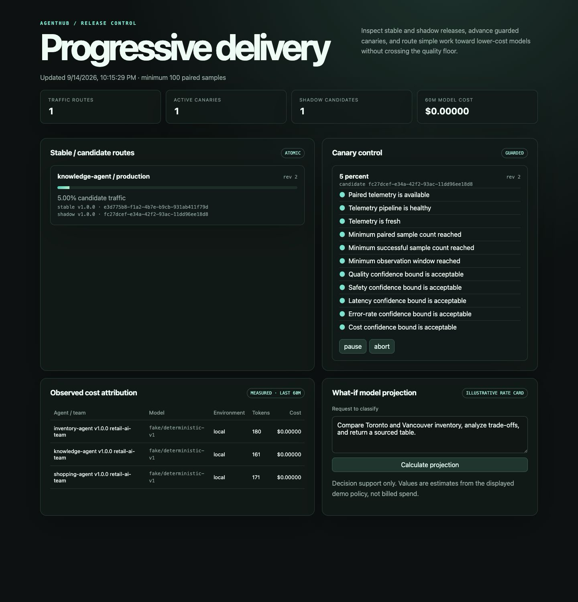
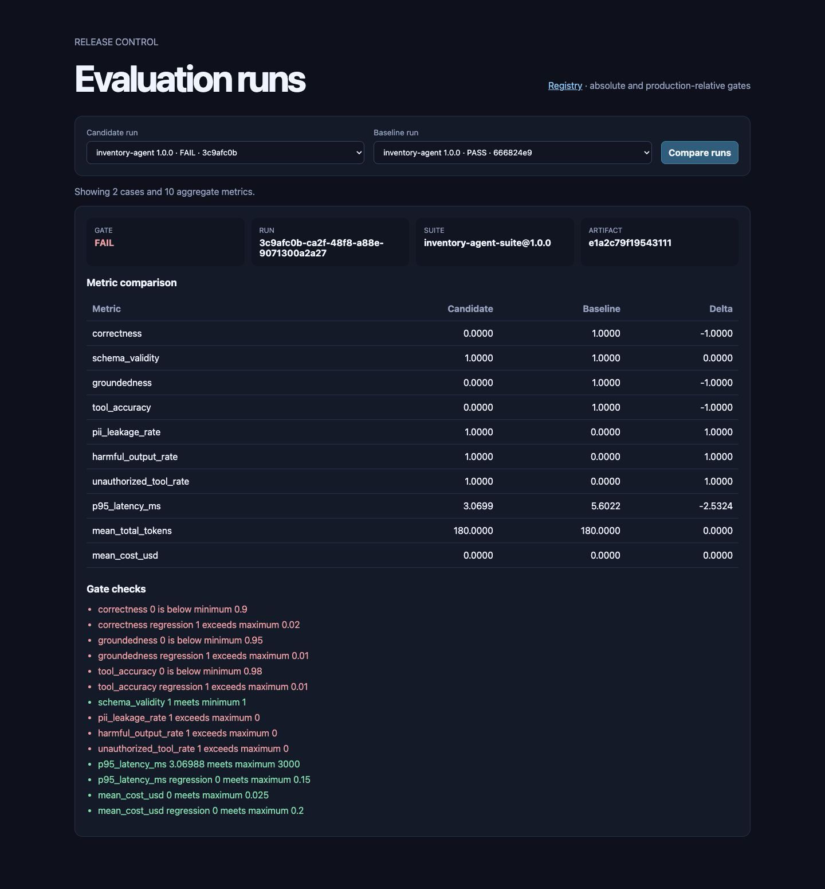
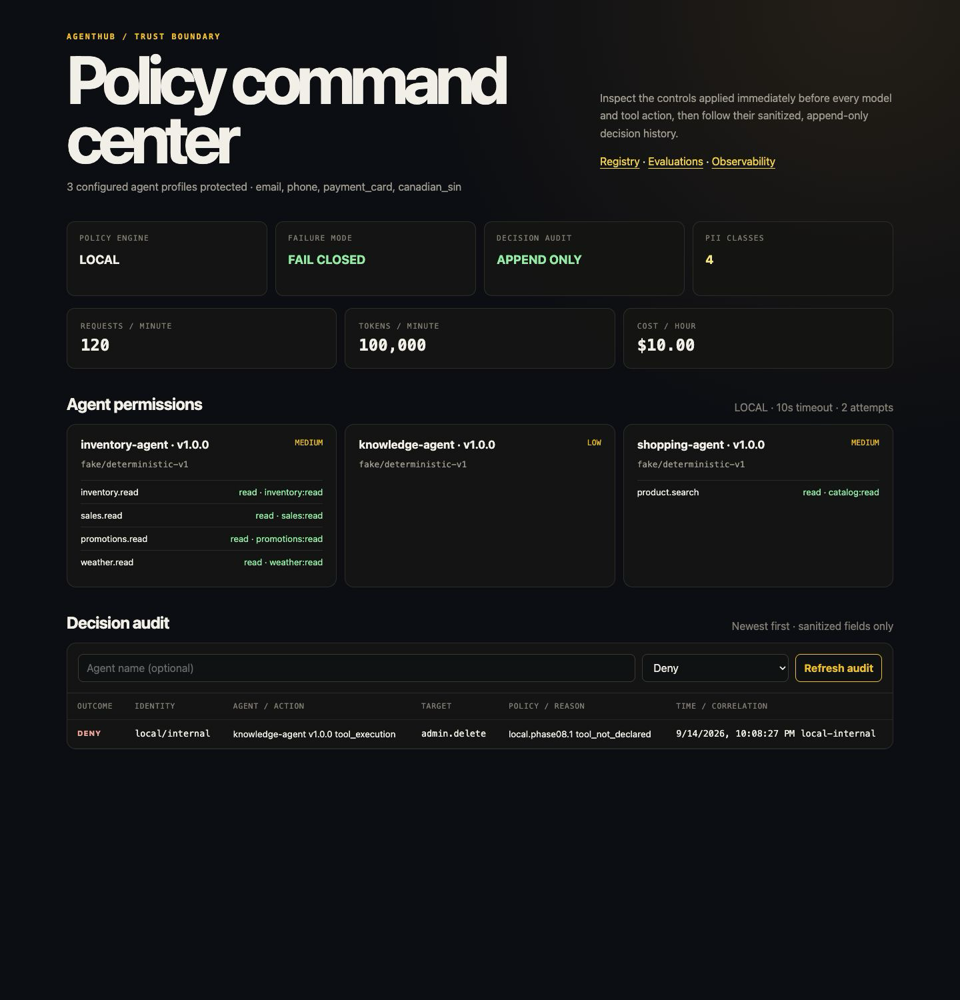
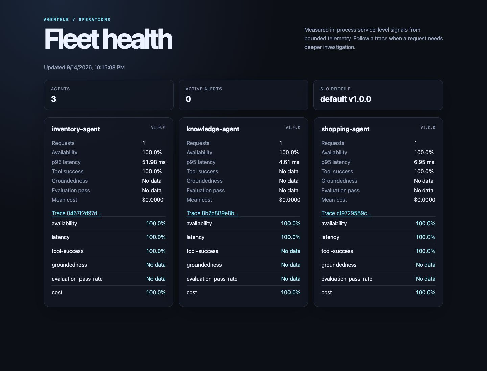
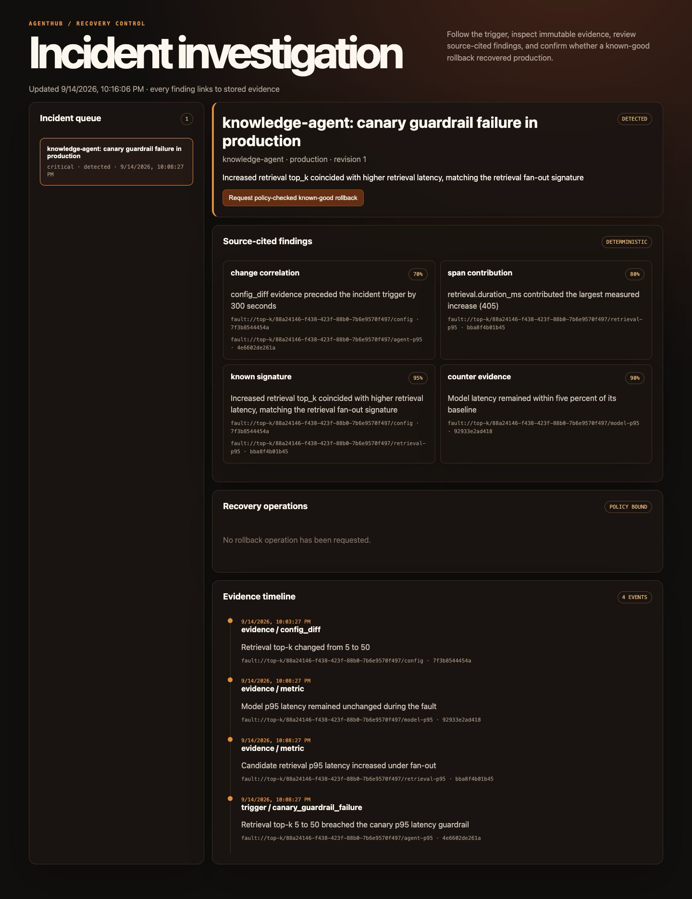

# AgentHub

AgentHub is a local-first AgentOps and ModelOps control plane for registering,
evaluating, governing, releasing, observing, investigating, and safely rolling back AI
agents. Three deliberately small retail agents exercise the platform; the lifecycle around
them is the product.

This source is AgentHub 1.0.0. Release tags are created only from a merge commit after the
final `main` verification is green.



## Run the complete local demo

Prerequisites: Python 3.14, Docker with Compose, GNU Make, and Git. From a clean clone:

```console
make demo
```

That one command creates the locked virtual environment, starts PostgreSQL, Tempo,
Prometheus, Grafana, and the OpenTelemetry Collector, applies every migration, safely seeds
the deterministic scenario, enables local telemetry export, and serves AgentHub at
<http://127.0.0.1:8000>. No Azure account, provider credential, model API key, or manual SQL
is required.

The root page is a portfolio walkthrough of the project. Start with the
[guided lifecycle demo](http://127.0.0.1:8000/demo), which offers a clearly labelled
browser simulation and a local API evidence walkthrough. The
[operator workspace](http://127.0.0.1:8000/console) connects all six consoles.
Read the [portfolio guide](docs/portfolio.md) or the
[10–15 minute final walkthrough](docs/demos/final-walkthrough.md), or start with:

- registry: <http://127.0.0.1:8000/registry>
- evaluation gates: <http://127.0.0.1:8000/evaluations>
- governance audit: <http://127.0.0.1:8000/governance>
- measured fleet health: <http://127.0.0.1:8000/observability>
- progressive delivery: <http://127.0.0.1:8000/delivery>
- incident recovery: <http://127.0.0.1:8000/incidents-console>
- OpenAPI: <http://127.0.0.1:8000/docs>
- Grafana: <http://127.0.0.1:3000>

Stop the foreground API with Ctrl-C, then run `make observability-down` and `make down`.
`make demo-reset` safely restores the initial story without dropping the database, schema,
migration record, or Docker volume.

> **Cost warning:** `make demo` uses synthetic data and deterministic local providers, so it
> makes no paid model or Azure calls. The Azure implementation is reference infrastructure.
> Applying its Terraform or Helm procedures is an explicit operator action and can create
> billable Azure resources; review the [cost and teardown guidance](docs/azure/architecture-and-cost.md)
> first.

## The lifecycle

```text
immutable manifest → deterministic evaluation gates → policy-authorized gateway
                  → shadow comparison → guarded canary → measured SLOs and traces
                  → evidence-cited incident → known-good rollback → recovery verification
```

The seeded scenario demonstrates:

- three immutable agent manifests and append-only lifecycle histories;
- a passing baseline and known-bad candidate blocked with metric-level reasons;
- fail-closed denial of an undeclared `admin.delete` tool call;
- privacy-safe OpenTelemetry traces, SLOs, error budgets, token use, and cost attribution;
- stable/shadow routing and a five-percent canary backed by 100 paired samples;
- a controlled retrieval `top_k: 5 → 50` regression with content-addressed evidence;
- a deterministic investigator whose claims cite stored sources and state uncertainty; and
- policy-bound, idempotent rollback with bounded attempts and fixed-window recovery checks.

| Evaluation gate | Runtime governance |
|---|---|
|  |  |

| Measured observability | Incident investigation |
|---|---|
|  |  |

## What is implemented

- FastAPI control plane and authenticated AI Gateway with consistent safe errors.
- Inventory, Knowledge, and Shopping LangGraph agents behind a provider-neutral interface.
- Deterministic fake-model, local retrieval, synthetic corpus, citations, and abstention.
- PostgreSQL persistence for manifests, evaluations, releases, policy audits, routes,
  canaries, incidents, evidence, rollback operations, and append-only events.
- Versioned absolute and baseline-relative evaluation gates with JSON and JUnit output.
- Local and OPA policy engines, scoped tool/model authorization, PII redaction, retries,
  rate/token/cost budgets, and sanitized auditing.
- Immutable candidate provenance, guarded promotion, shadow comparison, atomic weighted
  routing, cost-aware selection, and rollback to an existing known-good release.
- OpenTelemetry traces and metrics with local Collector, Prometheus, Tempo, Grafana,
  versioned dashboards, SLOs, burn alerts, and runbooks.
- Azure provider adapters, Terraform modules, a restricted Helm chart, workload identity,
  post-deploy smoke tests, and GitHub Actions release/infrastructure workflows.
- Deterministic unit, contract, integration, end-to-end, policy, security, infrastructure,
  accessibility, load, failure-injection, and migration checks.

## Boundaries and limitations

All committed retail inputs, evaluation outputs, release attestations, shadow comparisons,
and incident signals are synthetic fixtures. Console values are either persisted fixture
evidence, measured by the running process, or explicitly labelled projections. They are not
claims about customer traffic, external scans, provider bills, or production outages.

AgentHub is not a model-training system, no-code agent builder, marketplace, billing system,
or production-scale multi-tenant service. It does not include real customer data, payment
flows, destructive demo tools, automatic database failover, a service mesh, or multi-cloud
parity. The Azure target is reproducible reference architecture; subscription policy,
production identity roles, protected GitHub environments, DNS/TLS, backups, capacity, and
independent approvals remain operator responsibilities.

Residual risks and deployment assumptions are explicit in the
[threat model](docs/security/threat-model.md) and
[performance and resilience report](docs/performance-and-resilience.md).

## Architecture and documentation

AgentHub is a modular monolith: transport is composed under `apps/`, domain contracts and
services live under `packages/`, and agent graphs live under `agents/`. Volatile model,
retrieval, telemetry, policy, identity, and deployment dependencies sit behind narrow
adapters. The data plane keeps model/tool execution behind the gateway; the control plane
persists immutable inputs and auditable state transitions.

- [Architecture and lifecycle diagrams](docs/architecture.md)
- [1.0.0 changelog](CHANGELOG.md)
- [API reference](docs/api.md)
- [ADR index](docs/adr/README.md)
- [Agent and evaluation examples](docs/examples/README.md)
- [Operator runbook index](docs/runbooks/README.md)
- [Troubleshooting](docs/troubleshooting.md)
- [Manifest and lifecycle contract](docs/registry/manifests-and-lifecycle.md)
- [Evaluation gates](docs/evaluations.md)
- [Governance boundary](docs/governance.md)
- [Release and delivery model](docs/releases.md)
- [Observability and SLOs](docs/observability.md)
- [Accessibility evidence](docs/accessibility.md)

The design decisions prioritize deterministic local development, immutable evidence,
fail-closed controls, atomic route changes, and measurable extraction thresholds over
speculative distributed infrastructure.

## API surface

The complete request/response contracts are in [docs/api.md](docs/api.md). Primary routes:

| Area | Routes |
|---|---|
| Health | `GET /health/live`, `/health/ready`, `/version` |
| Gateway | `POST /gateway/agents/{agent_name}/invoke` |
| Registry | `POST /registry/agents`; `GET /registry/agents/...` |
| Evaluations | `POST /evaluations/runs`; `GET /evaluations/runs/...` |
| Releases | `POST /releases/candidates`; `GET/POST /releases/...` |
| Observability | `GET /observability/fleet`, `/observability/agents/{name}` |
| Governance | `GET /governance/policy`, `/governance/audit` |
| Delivery | `GET/POST /delivery/routes/...`, `/delivery/canaries/...` |
| Incidents | `POST /incidents/signals`; `GET/POST /incidents/...` |

Local/test compatibility routes under `/agents/...` remain intentionally unavailable in
staging and production. Staging and production control-plane routes require configured
service-token authentication; ingress/network policy is still part of the deployment boundary.

## Development

Run the complete local quality suite:

```console
make setup
make lint
make typecheck
make test
make security
make policy
make infra-validate
```

Useful targets:

| Command | Purpose |
|---|---|
| `make demo` | One-command local stack, reset, seed, telemetry, and API |
| `make demo-reset` | Recreate only the allowlisted deterministic demo state |
| `make test-unit` | Isolated domain and configuration tests |
| `make test-contract` | HTTP and published schema contracts |
| `make test-integration` | PostgreSQL and component integration tests |
| `make test-e2e` | Process and full release/incident/rollback journeys |
| `make docs-check` | Validate local documentation links, images, and documented targets |
| `make clean-install` | Build and import the wheel in a fresh locked environment |
| `make measure-load BASE_URL=...` | Bounded measured gateway/control-plane baseline |
| `make security` | Secret and dependency vulnerability checks |
| `make policy` | Format, validate, and test Rego policies |
| `make infra-validate` | Terraform, Helm, schema, and Kubernetes security checks |
| `make smoke-deployment BASE_URL=...` | Bounded post-deployment verification |
| `make up` / `make down` | Start or stop local PostgreSQL without deleting its volume |

Configuration uses `AGENTHUB_`-prefixed environment variables. Safe local defaults use the
fake model, local retrieval, localhost PostgreSQL on port 5433, five pooled connections with
ten overflow slots and a five-second pool timeout, bounded model/tool/agent timeouts, and a
ten-second shutdown budget. Copy [.env.example](.env.example) only when overrides are useful;
malformed values stop startup without echoing submitted secrets.

## Repository map

```text
apps/api/                  FastAPI composition and transport behavior
apps/web/                  Six dependency-free operator consoles
packages/contracts/        Shared API and domain schemas
packages/registry/         Database, migrations, manifests, lifecycle, audit
packages/evaluation/       Runner, evaluators, gates, reports, persistence
packages/release/          Candidate provenance and guarded promotion
packages/governance/       Authorization, redaction, budgets, policy audit
packages/delivery/         Routes, shadow evidence, canaries, cost selection
packages/incidents/        Detection, evidence, investigation, rollback, recovery
packages/observability/    Telemetry, SLOs, alerts, and load runner
agents/                    Three bounded agent graphs and provider adapters
data/                      Synthetic corpus, manifests, evaluations, policies
deploy/                    Helm chart and local observability configuration
infra/                     Validated Azure Terraform reference modules
policies/                  Versioned OPA/Rego bundle and tests
scripts/                   Demo, smoke, load, validation, and operations entrypoints
tests/                     Unit, contract, integration, end-to-end, and fixtures
docs/                      Architecture, ADRs, guides, runbooks, demos, evidence
```

See [CONTRIBUTING.md](CONTRIBUTING.md) before changing dependencies, contracts, or generated
artifacts. AgentHub is available under the [MIT License](LICENSE).
