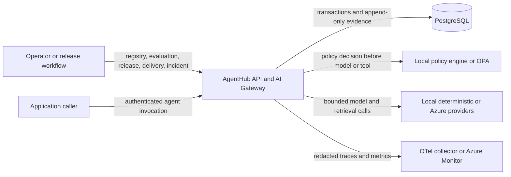
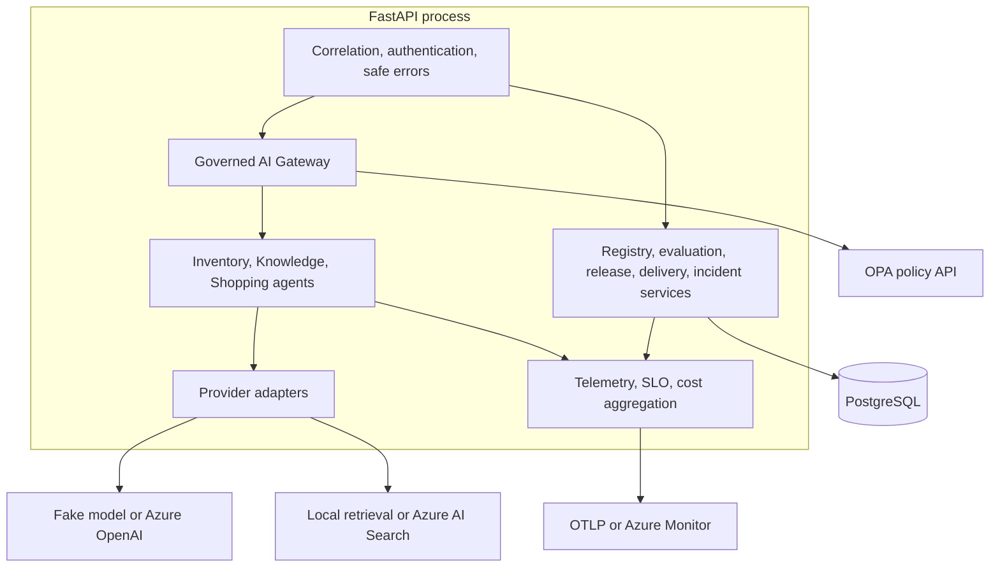
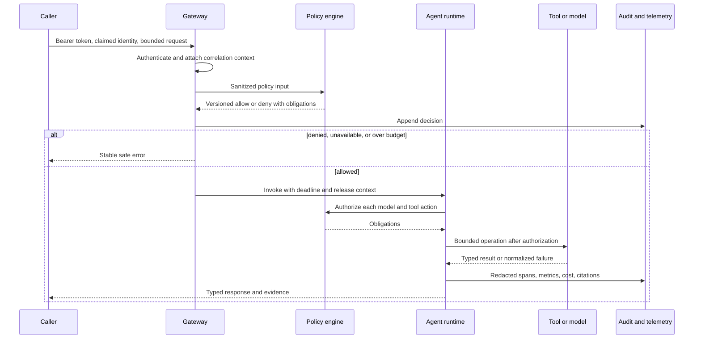
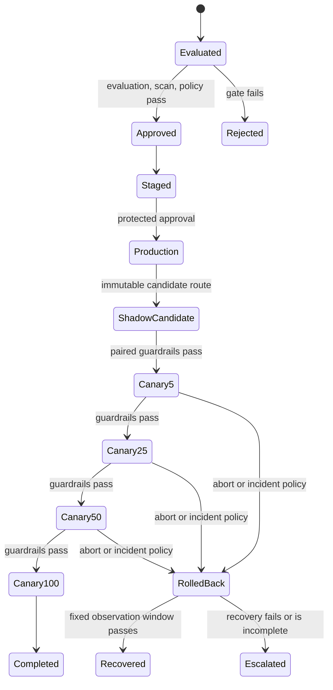
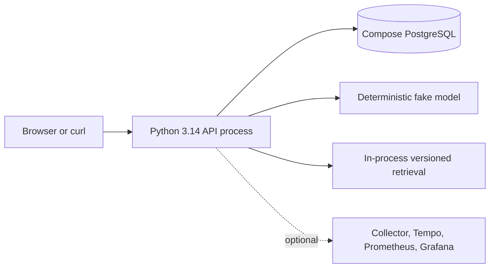

# AgentHub architecture

AgentHub is a modular-monolith control plane. One FastAPI process composes bounded agent
runtimes and focused domain packages; PostgreSQL owns durable control-plane state. The
same contracts support deterministic local adapters and explicitly configured Azure
adapters. This document describes implemented behavior unless a section says **Reference
Azure deployment** or **Future**.

## System context

The Gateway is the data-plane entry point for agent execution. Registry, evaluation,
release, delivery, observability, governance, and incident endpoints are control-plane
surfaces. In staging and production, every non-health surface requires a bearer token
whose configured service identity matches `X-AgentHub-Identity`.

## Runtime components

Packages under `packages/` own contracts and domain behavior. `apps/api/main.py` is the
composition root and HTTP transport. Agents depend on narrow model, retrieval, tool,
database, policy, and telemetry protocols rather than SDK clients. Synchronous database
work runs behind explicit thread boundaries at async endpoints.

## Governed invocation sequence

Policy and required audit failures fail closed. Prompts, model content, raw tool
arguments, credentials, and PII are not telemetry attributes. See the
[threat model](security/threat-model.md) for trust boundaries and residual risks.

## Release and recovery lifecycle

Candidate provenance, route targets, incident evidence, and rollback commands reference
immutable releases. State changes use optimistic revisions and idempotency keys, while
events are append-only. A rollback restores the stored known-good target atomically; it
does not rebuild an image or rewrite an evaluation.

## Persistence ownership

| Domain | Durable records | Mutation rule |
| --- | --- | --- |
| Registry | agents, versions, lifecycle audit | version content immutable; state transition is revision guarded |
| Evaluation | runs, cases, metrics, gate decisions | report graph append-only |
| Release | candidates, provenance, release events | evidence immutable; legal state transitions only |
| Governance | sanitized decision/enforcement events | append-only; required audit fails closed |
| Delivery | route snapshots, canaries, route/action events | allocation replacement and canary action are atomic and revision guarded |
| Incident | triggers, content-addressed evidence, rollback/recovery events | evidence and events append-only; operation state is policy constrained |

Alembic is the only schema migration mechanism. Readiness requires connectivity and the
exact expected revision, preventing old application/database combinations from serving.

## Deployment views

### Implemented local deployment

The default path needs no cloud account or paid call. `make demo` provisions the local
dependencies, creates the synthetic walkthrough, and starts the API.

### Reference Azure deployment

The repository includes Terraform and Helm for AKS, Azure Database for PostgreSQL,
Azure OpenAI, Azure AI Search, Azure Monitor, Key Vault, workload identity, private
networking, and an OPA sidecar. CI validates these definitions but never provisions
Azure. Operators must review and apply infrastructure explicitly using the
[Azure deployment runbook](runbooks/azure-deploy.md).

### Future, not implemented

Multi-region active/active routing, an independently scaled data plane, automatic
provider failover, managed tenant administration, self-service policy authoring, and
external identity-directory integration are not implemented. A module becomes a
separate service only after measured isolation or scaling needs justify a new ADR.

## Related decisions

See the [ADR index](adr/README.md), [API reference](api.md),
[operator runbooks](runbooks/README.md), and [architecture audit](architecture-audit.md).
