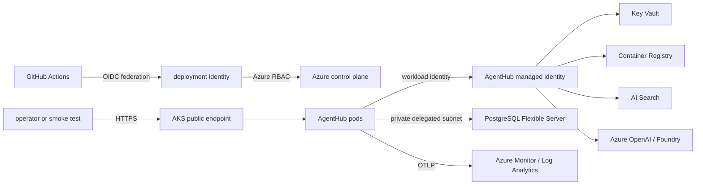

# Azure development architecture, security, and cost bounds

- Status: Approved for implementation
- Scope: `dev` only
- Region: Canada Central by default
- Estimate date: 2026-09-10

This document is the pre-provisioning record for AgentHub's Azure development environment. It
defines what Terraform may create, the security boundary, and the cost ceiling. Running
`terraform apply` creates billable resources and therefore remains an explicit operator action;
CI only formats, validates, scans, and produces a reviewed plan.

## Target topology

The development cluster uses the AKS Free control-plane tier and one Linux system node. It is not
a production availability design: the control plane has no financially backed SLA, the node pool
has one failure domain, and the PodDisruptionBudget can protect voluntary disruption only when a
second replica fits. Production requires a separate reviewed environment and cost model.

## Resource inventory

| Resource | Development choice | Purpose and boundary |
|---|---|---|
| Resource group | One environment-scoped group | Ownership, tags, cost queries, and complete teardown boundary |
| Virtual network | AKS subnet plus delegated PostgreSQL subnet | No overlapping address ranges; PostgreSQL has no public endpoint |
| AKS | Base SKU, Free tier, Azure CNI Overlay, one `Standard_D2as_v5` node | Entra RBAC, local accounts disabled, OIDC issuer and workload identity enabled |
| Container Registry | Basic | Admin account disabled; pull through kubelet identity; public endpoint retained because Private Link requires Premium |
| Key Vault | Standard, RBAC authorization | Soft delete and purge protection; no secret value enters Terraform; pods use the CSI driver and workload identity |
| PostgreSQL Flexible Server | Burstable `B_Standard_B1ms`, 32 GiB, PostgreSQL 16 | Private delegated subnet, private DNS, TLS, 7-day locally redundant backup, no HA in dev |
| Azure AI Search | Basic, one replica and one partition | Entra/RBAC data-plane auth; local key auth disabled; Free tier is rejected because it lacks managed identity support |
| Log Analytics workspace | Pay-as-you-go, 30-day retention | Receives bounded AKS and application telemetry; workspace daily cap is 0.15 GB |
| Application Insights | Workspace based | Azure Monitor destination for application OpenTelemetry |
| User-assigned identities | Deployment and AgentHub workload identities | Short-lived GitHub and Kubernetes federation; narrowly scoped Azure roles |
| Azure OpenAI / Foundry | Optional existing or explicitly enabled account and deployment | Provider adapter only; model deployment depends on regional availability and approved quota |
| Terraform state | Separate LRS storage account/container | Private container, versioning, RBAC auth, encryption at rest, and native blob lease locking |

Resource names derive from explicit `project`, `environment`, and suffix inputs. Every billable
resource carries `application=agenthub`, `environment=dev`, `managed-by=terraform`, and `owner`
tags. Terraform state bootstrap is deliberately separate from the environment state so destroying
the application environment cannot destroy its own audit trail or lock.

## Identity and network decisions

- GitHub Actions exchanges its repository/environment-scoped OIDC token for the deployment
  identity. No client secret, registry password, kubeconfig, or storage key is stored in GitHub.
- AKS issues projected service-account tokens. A federated identity credential binds only the
  `agenthub` namespace and `agenthub` service account to the workload identity.
- The workload identity receives data-plane roles only: read selected Key Vault secrets, query
  Search, and invoke the configured model. The kubelet identity receives ACR pull only.
- The AKS API is public for the cost-conscious dev environment but restricted to explicit operator
  CIDRs. Kubernetes local accounts are disabled and Entra RBAC is enabled.
- PostgreSQL uses private access in its delegated subnet. Key Vault uses its network ACL and the
  AKS subnet service endpoint. Search allows only the known AKS egress address when its SKU and
  regional behavior permit it. A future production environment should use private endpoints and
  Premium ACR after pricing those choices.
- The ingress service is the only public workload endpoint. Default-deny Kubernetes network
  policies restrict pod ingress and egress; DNS, PostgreSQL, Azure identity, Key Vault, Search,
  model, and telemetry destinations are explicitly allowed.
- Secret values are created outside Terraform. Terraform stores only Key Vault secret names and
  RBAC relationships; the CSI driver mounts values into the pod at runtime.

## Monthly development estimate

Estimates use public USD pay-as-you-go retail meters for Canada Central and 730 hours/month. They
exclude tax, negotiated discounts, support, model tokens, excess telemetry, egress, and unusually
large build artifacts. Actual prices must be refreshed before every apply.

| Component | Assumption | Approx. USD/month |
|---|---|---:|
| AKS control plane | Free tier | 0.00 |
| AKS node compute | `Standard_D2as_v5` Linux at $0.096/hour | 70.08 |
| Node OS disk | 32 GiB Standard SSD allowance | 3.00 |
| ACR | Basic at $0.1666/day | 5.06 |
| PostgreSQL compute | `B_Standard_B1ms` at $0.0185/hour | 13.51 |
| PostgreSQL storage | 32 GiB at $0.1265/GiB-month | 4.05 |
| AI Search | Basic, one search unit at $0.101/hour | 73.73 |
| Key Vault | Standard, under 10,000 operations | 0.03 |
| Log Analytics | At or below the first 5 GB/month billing-account allowance | 0.00 |
| State storage | LRS, under 1 GiB plus low transaction volume | 0.10 |
| Load balancer, public IP, DNS, and light egress | Planning allowance; usage dependent | 15.00 |
| **Always-on fixed planning total** | Before Azure OpenAI and overages | **184.56** |

The approved development ceiling is **USD 200/month before model usage**. The estimate is not a
budget guarantee. Apply must be blocked if the refreshed fixed estimate exceeds that ceiling
unless the reviewer explicitly raises `monthly_cost_limit_usd`.

For an eight-hour weekday schedule (about 176 node and database hours), node compute falls to
about $16.90 and PostgreSQL compute to about $3.26. Search is billed while the service exists and
cannot be stopped, so the comparable scheduled estimate remains about **USD 120/month**. Delete
and recreate the complete resource group for longer idle periods; do not rely on stopping AKS
alone.

## Cost controls

1. Run the repository cost estimator and inspect the Azure Retail Prices API date before apply.
2. Require an Azure budget alert at 50%, 75%, 90%, and 100% of the environment ceiling. A budget
   alerts but does not automatically stop resources.
3. Cap Log Analytics at 0.15 GB/day, retain 30 days, and collect only the documented AKS control
   plane categories plus AgentHub telemetry.
4. Keep one on-demand node with conservative maximum autoscaling. Spot nodes, Premium registry,
   private endpoints, HA PostgreSQL, zone redundancy, and Defender plans are opt-in variables with
   visible cost impact.
5. Scale the AKS node pool to zero only when Azure permits it for a separate user pool. The dev
   system pool remains at one while the cluster exists.
6. Teardown the environment resource group after demonstrations. Preserve the separately scoped
   state account and its versioned state until the final destroy plan and resource inventory have
   been reviewed.
7. Query actual cost by the mandatory tags after deployment and compare it with this estimate.

## Quotas and manual prerequisites

Before planning, the operator must provide a subscription ID, tenant ID, owner tag, unique naming
suffix, approved GitHub repository/environment, and allowed AKS API CIDRs. The subscription must
have sufficient regional vCPU quota for the selected node SKU and permission to register the
required Azure resource providers.

Azure OpenAI / Foundry is optional because model availability and tokens-per-minute quota vary by
subscription, model, deployment type, and region. Terraform can create an account only when the
operator enables it. The operator must select an available model/version, obtain quota when
needed, and may need to create or approve the model deployment manually. The adapter accepts a
deployment endpoint and name; it never assumes that a public model name is deployable.

## References

- [AKS cluster-management pricing tiers](https://learn.microsoft.com/en-us/azure/aks/free-standard-pricing-tiers)
- [AKS workload identity](https://learn.microsoft.com/en-us/azure/aks/workload-identity-overview)
- [Key Vault provider for the Secrets Store CSI Driver](https://learn.microsoft.com/en-us/azure/aks/csi-secrets-store-driver)
- [Store Terraform state in Azure Storage](https://learn.microsoft.com/en-us/azure/developer/terraform/get-started/store-state-in-azure-storage)
- [Azure AI Search tiers](https://learn.microsoft.com/en-us/azure/search/search-sku-tier)
- [Azure AI Search service limits](https://learn.microsoft.com/en-us/azure/search/search-limits-quotas-capacity)
- [Try Azure AI Search for free](https://learn.microsoft.com/en-ca/azure/search/search-try-for-free)
- [PostgreSQL Flexible Server backup and restore](https://learn.microsoft.com/en-us/azure/postgresql/backup-restore/concepts-backup-restore)
- [Azure OpenAI / Foundry quota](https://learn.microsoft.com/en-us/azure/foundry/openai/how-to/quota)
- [Azure Monitor pricing](https://azure.microsoft.com/en-us/pricing/details/monitor/)
- [Azure Retail Prices API](https://learn.microsoft.com/en-us/rest/api/cost-management/retail-prices/azure-retail-prices)
