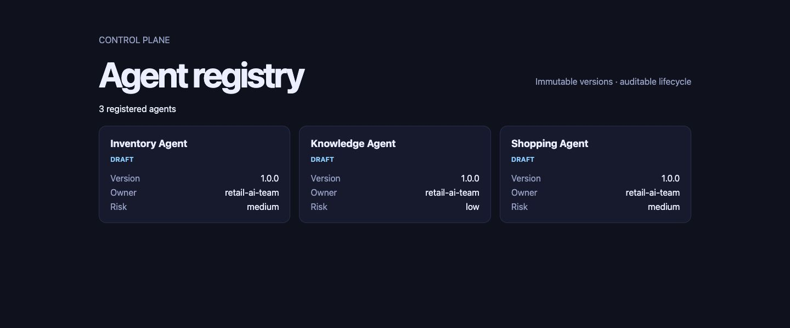

# Final AgentHub walkthrough

This is a 10–15 minute, deterministic demonstration of AgentHub's complete local
control-plane story. It uses committed fictional retail data, the fake model provider,
the local retrieval adapter, and a local PostgreSQL database. Nothing in this walkthrough
is production traffic, a cloud security attestation, a customer incident, or billed model
spend.

## 1. Start the platform (2 minutes)

From a clean checkout with Python 3.14, Docker Compose, Git, and GNU Make installed:

```console
make demo
```

The command installs the locked dependencies, starts PostgreSQL and the local
OpenTelemetry stack, migrates the database, resets only the allowlisted AgentHub tables,
seeds the scenario, and serves the API at <http://127.0.0.1:8000>. It prints the generated
evaluation, release, route, canary, and incident IDs. Keep this terminal open.

Use `make demo-reset` whenever the story needs to return to its initial state. The reset
has multiple local-only safety checks and never drops a database, schema, migration record,
or Docker volume.

## 2. Registry and immutable versions (1 minute)

Open <http://127.0.0.1:8000/registry>. Confirm that Inventory, Knowledge, and Shopping are
registered at version 1.0.0. Select a card to show its immutable version history and owner.



Talking point: registration is idempotent, but an existing semantic version cannot be
silently replaced by different manifest content. Lifecycle changes use optimistic
revisions and append-only audit events.

## 3. Evaluation block and pass (2 minutes)

Open <http://127.0.0.1:8000/evaluations>. Select the Inventory `FAIL` run as the candidate
and the Inventory `PASS` run as the baseline, then choose **Compare runs**.


Call out the exact reasons: the candidate loses correctness, groundedness, and tool
accuracy and introduces PII, harmful-output, and unauthorized-tool failures. Schema,
latency, and cost checks still report their own results. A release cannot leave the
evaluated state when any required gate fails.

## 4. Runtime governance denial (1 minute)

Open <http://127.0.0.1:8000/governance>, filter the decision audit to **Deny**, and inspect
the seeded attempt to call `admin.delete` from the Knowledge Agent.


Talking point: this is a real decision from the local policy engine, recorded through the
same authorization boundary used before model and tool actions. The audit contains identity,
target, policy version, reason, timestamp, and correlation ID—not prompt or PII payloads.

## 5. Generate measured telemetry (2 minutes)

In a second terminal, invoke all three agents through the authenticated local gateway:

```console
curl -sS http://127.0.0.1:8000/gateway/agents/inventory-agent/invoke \
  -H 'Content-Type: application/json' \
  -H 'X-AgentHub-Identity: local/demo' \
  -H 'X-Correlation-ID: final-demo-inventory' \
  -d '{"query":"Which Toronto stores may run low on snow shovels this weekend?","seed":11,"as_of":"2026-09-08"}'

curl -sS http://127.0.0.1:8000/gateway/agents/knowledge-agent/invoke \
  -H 'Content-Type: application/json' \
  -H 'X-AgentHub-Identity: local/demo' \
  -H 'X-Correlation-ID: final-demo-knowledge' \
  -d '{"query":"Can I return an unopened product after 20 days?","seed":4}'

curl -sS http://127.0.0.1:8000/gateway/agents/shopping-agent/invoke \
  -H 'Content-Type: application/json' \
  -H 'X-AgentHub-Identity: local/demo' \
  -H 'X-Correlation-ID: final-demo-shopping' \
  -d '{"query":"Recommend a snow shovel under $60.","seed":7}'
```

Open <http://127.0.0.1:8000/observability>. These values come from the current API process;
they are not seeded dashboard decoration. Follow a trace link into the provisioned local
Grafana/Tempo instance at <http://127.0.0.1:3000>.


## 6. Shadow evidence and five-percent canary (2 minutes)

Open <http://127.0.0.1:8000/delivery>. The Knowledge Agent route keeps the stable release
as the production target while five percent of traffic is assigned to the candidate. The
canary shows the minimum paired-sample, observation-window, telemetry, quality, safety,
latency, error-rate, and cost guardrails.


The left cost table is observed model usage from the current process. The what-if panel is
an illustrative rate-card projection for decision support; it is explicitly not billed spend.
Shadow results are stored comparisons and cannot replace the user-visible stable response.

## 7. Investigate and request rollback (3 minutes)

Open <http://127.0.0.1:8000/incidents-console>. The injected fixture changes retrieval
`top_k` from 5 to 50. The timeline shows retrieval p95 increasing while model p95 remains
stable, and each deterministic finding cites immutable, content-addressed evidence.


Choose **Request policy-checked known-good rollback**. AgentHub derives eligibility from
persisted incident, release, route, canary, and gate state; the browser sends operator intent,
not client-asserted policy facts. The result restores candidate traffic to zero through the
audited route transition and reports that recovery verification is still required.

This local click does not fabricate five minutes of post-rollback observations. The complete
deterministic lifecycle—including `requested → executed → verifying → recovered`, incident
resolution, and append-only audit ordering—is verified by:

```console
make test-e2e
```

The operational procedure and escalation boundary are in the
[incident recovery runbook](../runbooks/incident-recovery.md).

## 8. Reset or stop

To repeat the walkthrough, stop the foreground API with Ctrl-C and run:

```console
make demo-reset
make run
```

To stop local services without deleting the PostgreSQL volume:

```console
make observability-down
make down
```

## What this demonstration proves—and does not prove

It proves deterministic registry, evaluation, authorization, telemetry, delivery,
investigation, and rollback behavior against the real local services and persistence paths.
It does not prove production capacity, Azure configuration, independent human approval,
third-party provider uptime, or the accuracy of a real model. See the
[threat model](../security/threat-model.md), [performance report](../performance-and-resilience.md),
and [Azure cost guidance](../azure/architecture-and-cost.md) before treating the reference
deployment as production-ready.
